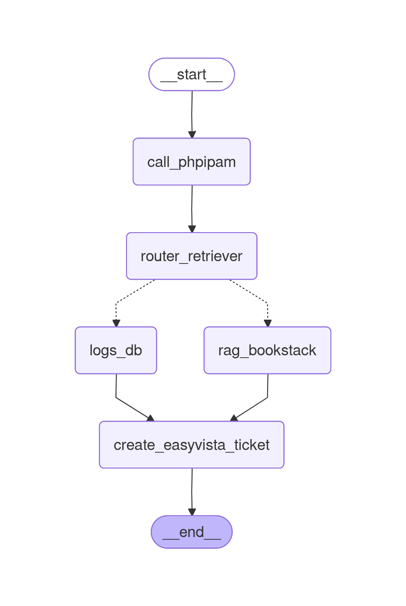

# 🚀 Agente de Auto-Remediación SRE




App disponible en [StreamLit Hub](https://diegoxwehunt.streamlit.app/)

Este proyecto es una prueba de concepto de un **AI Agent** diseñado para automatizar la resolución de incidentes de infraestructura. El agente escucha alertas de sistemas de monitorización (como Zabbix), evalúa el contexto, recupera información técnica de manuales corporativos y genera tickets estructurados listos para ser procesados.

## 🎯 Objetivo del Proyecto

Demostrar la capacidad de construir e integrar sistemas complejos de Inteligencia Artificial que aporten valor real al negocio, reduciendo el trabajo manual en operaciones IT. 

El agente es capaz de:
1. **Recibir alertas** a través de un webhook asíncrono.
2. **Enriquecer el contexto** simulando llamadas a un IPAM (PhpIPAM).
3. **Tomar decisiones** basadas en la naturaleza de la alerta (Hardware, Red, Seguridad).
4. **Recuperar manuales de infraestructura** mediante técnicas avanzadas de RAG.
5. **Sintetizar la solución** en un formato estructurado para herramientas ITSM (EasyVista).

## 🛠️ Stack Tecnológico y Técnicas Utilizadas

Este proyecto utiliza un stack moderno y escalable, pensado para entornos de producción:

### 1. Orquestación y Flujo de Trabajo (LangGraph)
El "cerebro" del agente está construido con **[LangGraph](https://langchain-ai.github.io/langgraph/)**. En lugar de depender de cadenas lineales rígidas o agentes puramente autónomos (que pueden ser impredecibles), LangGraph permite definir un flujo de trabajo cíclico, determinista y seguro (StateGraph). Esto es fundamental en SRE, donde la fiabilidad es clave.

### 2. RAG Avanzado: Multi-Query Retrieval
Las alertas de infraestructura suelen ser escuetas (ej. "Latencia alta"). Una simple búsqueda vectorial puede fallar al intentar relacionar el problema con el manual. 
Para resolver esto, se ha implementado **Multi-Query Retrieval** usando LangChain y **ChromaDB**:
* El LLM (Gemini) genera múltiples variaciones semánticas del problema original.
* Estas consultas iteradas permiten buscar en la base de datos de manera más robusta, mejorando significativamente la precisión de los pasos de resolución devueltos.
* Los documentos se dividen usando `MarkdownHeaderTextSplitter` para mantener la jerarquía estructural de los manuales (Categoría -> Problema -> Solución).

### 3. Arquitectura Asíncrona (FastAPI & Asyncio)
Todo el pipeline (desde el webhook en **FastAPI** hasta los nodos de LangGraph y las llamadas de red a Gemini/ChromaDB) está implementado de forma **asíncrona (`async/await`)**.
Esto permite al servidor escalar verticalmente y manejar ráfagas de múltiples alertas simultáneas sin bloquear el bucle de eventos, un requisito indispensable en monitorización y sistemas de alta disponibilidad.

### 4. Salida Estructurada (Pydantic)
La comunicación entre los diferentes pasos del LLM se rige bajo contratos estrictos usando modelos de **Pydantic**. El modelo asegura que tanto las decisiones del enrutador como la generación final del ticket de EasyVista cumplan siempre con un formato JSON predecible.

## 🗂️ Estructura del Proyecto

```text
WeHuntInterview/
├── src/
│   ├── agent.py        # Definición del grafo y lógica de los nodos
│   ├── rag.py          # Lógica del motor RAG y Multi-Query
│   └── server.py       # Endpoint FastAPI (Webhook)
├── data/
│   ├── documents/      # Base de conocimiento en Markdown (Hardware, Red, Seguridad)
│   └── test_cases.json # Batería de escenarios de prueba para la evaluación
├── scripts/
│   └── demo_agent.py   # Script de prueba rápida en terminal
├── tests/
│   └── test_agent.py   # Pruebas unitarias automatizadas (Async)
├── app.py              # Dashboard interactivo en Streamlit
└── requirements.txt    # Dependencias de Python
```

## 🚀 Cómo ejecutarlo

### Requisitos previos
* Python 3.10+
* Clave de API de Google Gemini (`GOOGLE_API_KEY`)

```bash
# 1. Configurar variables de entorno
echo "GOOGLE_API_KEY=tu_api_key_aqui" > .env

# 2. Iniciar el Dashboard Interactivo (Streamlit)
streamlit run app.py
```

En el dashboard, podrás simular diferentes errores y visualizar en tiempo real cómo el agente procesa la información nodo a nodo hasta generar la solución.

### Alternativas de ejecución:

**Levantar el servidor Webhook:**
```bash
uvicorn src.server:app --reload
```

**Ejecutar los tests unitarios:**
```bash
python -m unittest tests/test_agent.py
```
